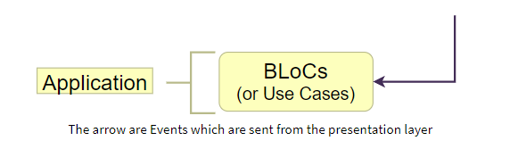
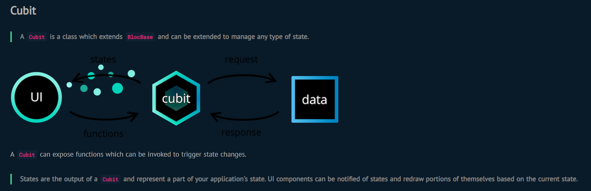
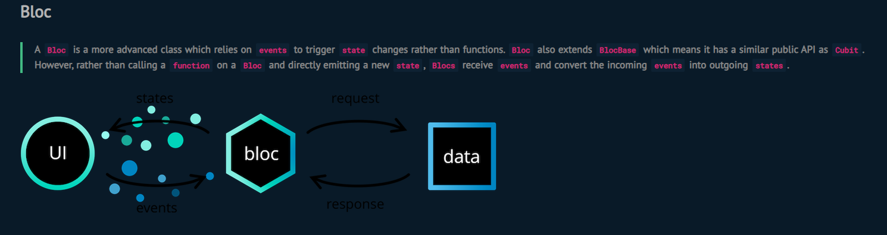

# Application Layer #3

_See: [Guide](https://resocoder.com/2020/03/09/flutter-firebase-ddd-course-1-domain-driven-design-principles/)_

This layer is away from all the outside interfaces of an app. **You aren't going to find any UI code, network code, or database code here**. Application layer has only one job -
orchestrating all the other layers. No matter where the data originates (user input, real-time Firestore Stream, device location), its **first destination** is going to be the
application layer.

The role of the application layer is to decide "what to do next" with the data. It doesn't perform any complex business logic, instead, it mostly just makes sure that the user
input is validated (by calling things in the **domain layer**) or it manages subscriptions to **infrastructure** data Streams (not directly, but by utilizing the dependency
inversion principle).

> If you're not using BLoC, do yourself a favor, and don't put the application logic into View Models. I'd recommend creating reusable, one-purpose UseCase classes. Learn more from the [mysterious uncle](https://blog.cleancoder.com/uncle-bob/2012/08/13/the-clean-architecture.html#use-cases).

## BLoC

_See: [Guide](https://bloclibrary.dev/#/gettingstarted)_

