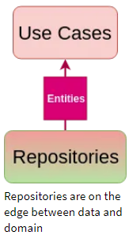

# Domain Layer #1

_See: [Guide](https://resocoder.com/2020/03/09/flutter-firebase-ddd-course-1-domain-driven-design-principles/)_

_Note: Domain layer can and will be different as presented in the guide, because it is too cumbersome to write and follow the guide to the letter. This may change in the future if
Dart add better support for sealed classes and immutable objects._

**Domain** is the inner layer which shouldn't be susceptible to the whims of changing data sources or porting our app to Angular Dart. It will contain only the core **business
logic (use cases)** and **business objects (entities)**. It should be totally independent of every other layer.

> _**Use Cases** are classes which encapsulate all the business logic of a particular use case of the app (e.g. GetRandomApprover)._

```
/// ! Assign the Params generic type to Null when no parameters are needed
/// e.g.: implements UseCase<Approver, Null> and call([Null params])
abstract class UseCase<Type, Params> {
    Future<Either<IFailure, Type>> call(Params params);
}
```

> _**Value Objects** are entities that use the **Formz**  package (or any other package) to validate logic, bypassing the need to write validation in **Use Cases** ._

```
/// Validation errors for the [Email] [FormzInput].
enum EmailValidationError {
  /// Generic invalid error.
  invalid
}

/// Form input for an email input.
class Email extends FormzInput<String, EmailValidationError> {
  const Email.pure() : super.pure('');

  const Email.dirty([String value = '']) : super.dirty(value);

  //https://stackoverflow.com/questions/16800540/validate-email-address-in-dart
  static final RegExp _emailRegExp = RegExp(
    r"^[a-zA-Z0-9.!#$%&'*+/=?^_`{|}~-]+@[a-zA-Z0-9](?:[a-zA-Z0-9-]{0,253}[a-zA-Z0-9])?(?:\.[a-zA-Z0-9](?:[a-zA-Z0-9-]{0,253}[a-zA-Z0-9])?)*$",
  );

  @override
  EmailValidationError? validator(String? value) {
    return _emailRegExp.hasMatch(value ?? '')
        ? null
        : EmailValidationError.invalid;
  }
}
```

But... How is the **domain layer** completely independent when it gets data from a **Repository**, which is from the **infrastructure layer**? Do you see that fancy colorful
gradient for the **Repository**? That signifies that it belongs to both layers at the same time. We can accomplish this with **dependency inversion**.



That's just a fancy way of saying that we create an abstract **Repository** class defining a contract of what the Repository must do - this goes into the **domain layer**. We then
depend on the Repository "contract" defined in **domain**, knowing that the actual implementation of the
**Repository** in the **infrastructure layer** will fulfill this contract.

> _**Dependency inversion** principle is the last of the SOLI**D** principles. It basically states that the boundaries between layers should be handled with interfaces (abstract classes in Dart)._