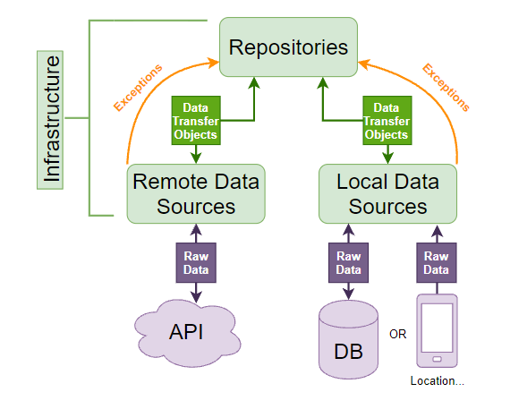

# Infrastructure Layer #2

_See: [Guide](https://resocoder.com/2020/03/09/flutter-firebase-ddd-course-1-domain-driven-design-principles/)_

Much like **presentation**, this layer is also at the boundary of our app. Although, of course, it's at the "opposite end"
and instead of dealing with the user input and visual output, it deals with APIs, Firebase libraries, databases and device sensors.



The infrastructure layer is composed of two parts - low-level **data sources** and high level **repositories**. Additionally, this layer holds **data transfer objects** (DTOs).
Let's break it down!

**DTO**s are classes whose sole purpose is to convert data between entities and value objects from the domain layer and the plain data of the outside world. As you know, only dumb
data like String or int can be stored inside Firestore, but we don't want this kind of unvalidated data throughout our app. To make things simple and get around implementing
complex mapping logic from JSON to domain **Entities** you can use the [freezed](https://pub.dev/packages/freezed)
and [json_serializable ](https://pub.dev/packages/json_serializable)  package to auto-generate it.

```
part 'approver_dto.freezed.dart';

part 'approver_dto.g.dart';

/// generate code with flutter packages pub run build_runner build --delete-conflicting-outputs
@freezed
class ApproverDto with _$ApproverDto {
  const factory ApproverDto({required String name, required String surname}) =
      _ApproverDto;

  factory ApproverDto.fromJson(Map<String, dynamic> json) =>
      _$ApproverDtoFromJson(json);

  factory ApproverDto.fromDomain(Approver approver) {
    return ApproverDto(
      name: approver.name,
      surname: approver.surname,
    );
  }
}

extension ApproverDtoX on ApproverDto {
  Approver toDomain() {
    return Approver(
      name: name,
      surname: surname,
    );
  }
}
```

**Data sources** operate at the lowest level. Remote data sources fit JSON response strings gotten from a server into DTOs, and also perform server requests with DTOs converted to
JSON. Similarly, local data sources fetch data from a local database or from the device sensors.

> Firebase client libraries like **cloud_firestore** and **firebase_auth** do the heavy lifting of data sources for us. That's why we won't create any data sources in guide.

**Repositories** perform an important task of being the boundary between the **domain** and **application** layers and the ugly outside world. It's their job to take **DTOs** and
unruly **Exceptions**
from data sources as their input, and return nice **Either<Failure, Entity>** as their output.

> If this is the first time you hear about **Either** your option is to read the **Dartz** [documentation](https://pub.dev/packages/dartz) or this Kotlin [documentation](https://arrow-kt.io/docs/0.11/apidocs/arrow-core-data/arrow.core/-either/)

If you don't use Firebase Firestore, you'll probably need to cache data locally yourself. In that case, it's the job of the **repository** to perform the **caching logic** and
orchestrate putting data from the remote data source to the local one.

```
abstract class ICacheClient {
  /// Writes the provide [key], [value] pair to the in-memory cache.
  void write<T extends Object>({required String key, required T value});

  /// Looks up the value for the provided [key].
  /// Defaults to `null` if no value exists for the provided key.
  T? read<T extends Object>({required String key});
}

/// An in-memory cache client.
@LazySingleton(as: ICacheClient)
class CacheClient implements ICacheClient {
  CacheClient() : _cache = <String, Object>{};

  final Map<String, Object> _cache;

  @override
  void write<T extends Object>({required String key, required T value}) {
    _cache[key] = value;
  }

  @override
  T? read<T extends Object>({required String key}) {
    final value = _cache[key];
    if (value is T) return value;
    return null;
  }
}
```