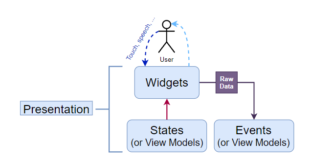

# Presentation Layer #4

_See: [Guide](https://resocoder.com/2020/03/09/flutter-firebase-ddd-course-1-domain-driven-design-principles/)_

This layer is all Widgets 💙 and also the state of the Widgets. I already mentioned that we're going to use BLoC in this series. If you're not familiar with this state management
pattern, I'd recommend you to check out [this tutorial](https://www.youtube.com/watch?v=THCkkQ-V1-8). The main difference from something like a ChangeNotifier is that BLoCs are
separated into 3 core components:

- States - Their sole purpose is to deliver values (variables) to the widgets.
- Events - Equivalent to methods inside a ChangeNotifier. These trigger logic inside the BLoC and can optionally carry some raw data (e.g. String from a TextField) to the BLoC.
- BLoC - NOT A PART OF THE PRESENTATION LAYER!!! But it executes logic based on the incoming events, and then it outputs states. So, if you're not using BLoC, just replace the
  State and Event classes with a single View Model class of your choice.

With Domain-Driven Design, **UI is dumbest part of the app**. That's because it's at the boundary of our code and it's totally dependent on the Flutter framework. Its logic is
limited to creating "eye candy" for the user. So while animation code does belong into this layer, even things like **form validation** are NOT done inside the presentation layer.

> A rule of thumb is that whenever some logic operates with data that is later on **sent to a server** or **persisted in a local database**, that logic has nothing to do in the presentation layer.